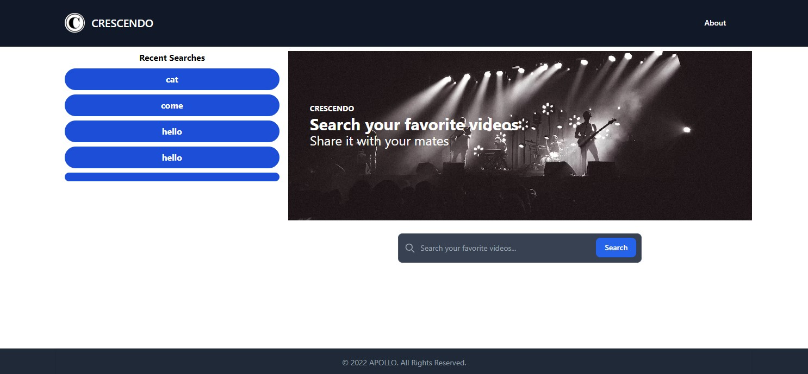
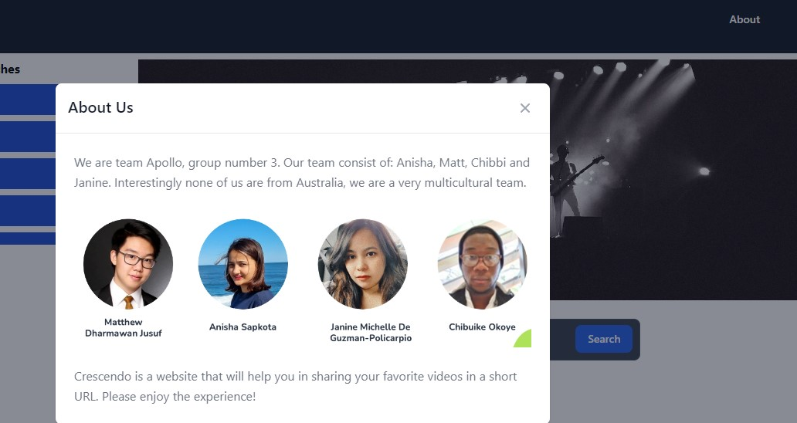
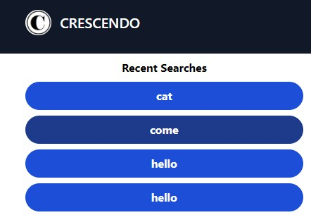
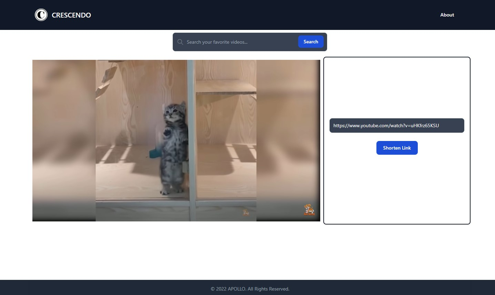
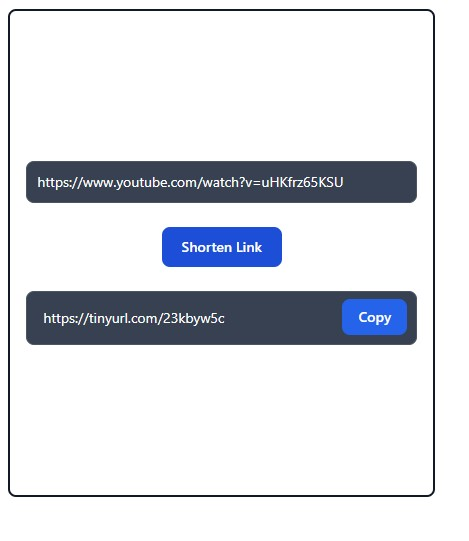

# Project Crescendo 🎬

`💠 Team Apollo's project is creating a video service where users can watch uploaded videos from content creators that can be shared via tinyUrl that shortens web service, which provides short aliases for redirection of long URLs.`

## Team - Apollo👬👭

`💠 Derived from the greek God Apollo who was a major Greek god associated with the bow, music, and divination. The epitome of youth and beauty, source of life and healing, patron of the arts, and as bright and powerful as the sun itself, Apollo was, arguably, the most loved of all the gods.`

## Links to Repo and deployment📌

🔸 GitHub Repository [link](https://github.com/mecuboi/crescendo-website)

🔸 Site is live [HERE](https://mecuboi.github.io/crescendo-website/)

## Installation ✅

🟢 We first created 3 separate html for the 3 different page of the website

🟢 We follow the design that we've created in our wireframe using tailwind as our CSS tool

🟢 Once we are happy with the design, we then use JS to dynamically create the recent search, search result and content page

🟢 The next step is then to develop the logic for each of the website's function

🟢 We use the help of jQuery for most of our logic

🟢Develop the logic for search bar in each page, carousel image, rendering youtube video result to our page, rendering the video in the   
  content page, fetch logic for youtube and tiny url, logic to dynamically render the tiny URL link in the content page, and logic to set recent search to local storage
  
🟢 Then we create a modal to pop up when the about button is clicked

🟢 After all functionalities are working, we just polished up the UI


## User Story 👨

```http
 As an end user and social media influencer, I want to be able to watch videos I’m interested in and get shorter links for it so that my posts will look organized and trustworthy.
```

## What this project does 💡💡💡

```http
GIVEN a video browsing service using both YouTube API and TinyUrl API
WHEN I click on the crescendo icon
THEN I am brought to the home page
WHEN I types in a query on the search bar, and clicks “search” or press the "Enter" key
THEN I am presented with a list of results that appear below, based on the closest match available to the word or words used in the query
WHEN I click on a video on the results list
THEN I am forwarded to a new html with an iframe where the video is redirected at and played
WHEN I view the video.html
THEN I am presented with an iframe on the left side and a TinyUrl API on the right side of the webpage
WHEN I click on "Shorten Link" button on the video.html
THEN I am presented with a shortened Url for the video

```


# Screenshots


## Index HTML / Homepage



## Cresendo Icon that links to home


## Search bar


## About Us



## Research searches bar



## Search html with results


## Video html



## TinyUrl widget on video html


## Learning Resources 🔗

🔸 [Tailwind Toolbox](https://tailwindtoolbox.com/)

🔸 [Tailwind CSS](https://tailwindcss.com/)

🔸 [YouTube Data API v3 Tutorial](https://www.youtube.com/watch?v=TE66McLMMEw)

🔸 [TinyUrl](https://tinyurl.com/app/dev)

🔸 [Clipboard copy](https://www.w3schools.com/howto/howto_js_copy_clipboard.asp)

🔸 [Flowbite](https://flowbite.com)

## Credits 📑	 

 🔹Matthew Dharmawan Jusuf - Github [Profile](https://github.com/mecuboi/)

 🔹Anisha Sapkota - Github [Profile](https://github.com/anisha-sapkota)

 🔹Janine Michelle De Guzman-Policarpio - Github [Profile](https://github.com/jmdg1023)

 🔹Chibuike Okoye - Github [Profile](https://github.com/Notchibby)


## License 📜

[](https://github.com/mecuboi/crescendo-website/blob/main/LICENSE)